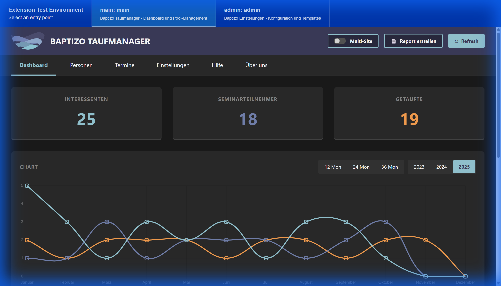
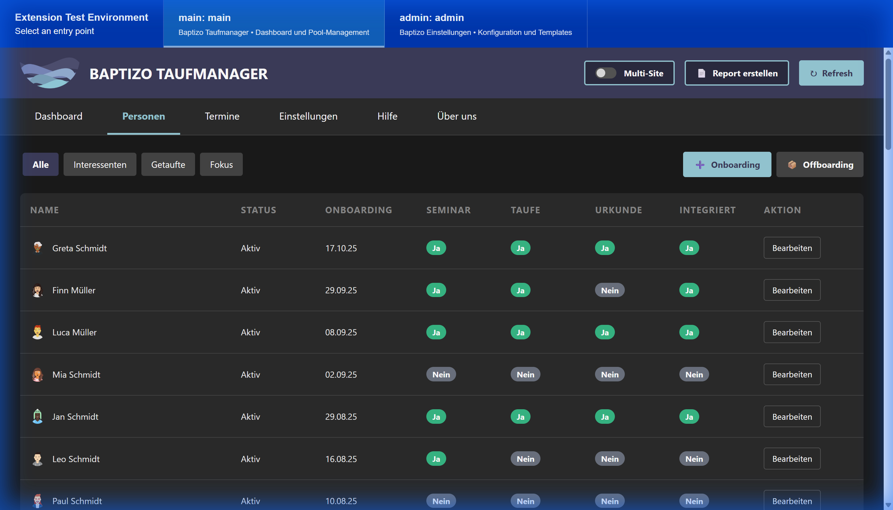
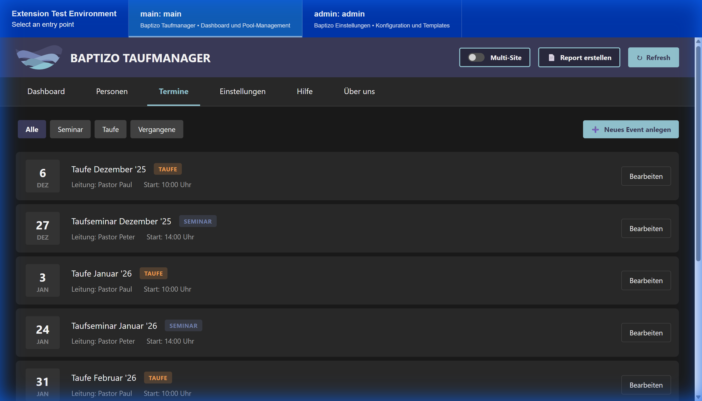
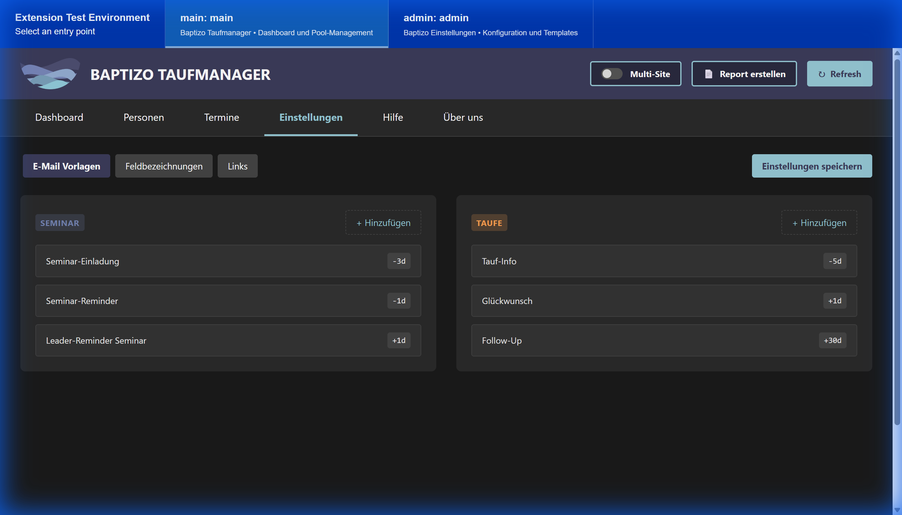

# Baptizo Taufmanager


## Zero-Admin durch intelligente Pool-Logik

**Baptizo Taufmanager** begleitet Menschen visuell von "Interessiert" bis "Integriert" – strukturiert, automatisiert und nachvollziehbar.

---

## 📸 Dashboard



---

## ✨ Features

### 🌊 **Trichter-Analyse**
Visuelle Auswertung des kompletten Taufprozesses:
- **Interessenten** → Erste Kontaktaufnahme
- **Seminarteilnehmer** → Aktive Vorbereitung
- **Getaufte** → Erfolgreiche Integration

### 🚀 **Smart Alerts**
Automatische Warnungen bei kritischen Status-Änderungen:
- Fehlende Taufurkunden
- Lange Inaktivität (>2w, >6w, >12w)
- Abgebrochene Prozesse ("Drop-offs")

### 👥 **Personen-Flow**
Einfaches Management des kompletten Lebenszyklus:
- **Onboarding:** Person aus ChurchTools auswählen → automatisch in Gruppe eintragen
- **Status-Tracking:** Seminar geplant/besucht, Taufe geplant/durchgeführt, Urkunde ausgehändigt
- **Offboarding:** Sauberes Archivieren mit einem Klick

### 🎨 **High-End UX**
Moderne Benutzeroberfläche für professionelle Gemeinden:
- **Dark Mode** optimiert für lange Arbeitssessions
- **Responsive Design** funktioniert auf Desktop, Tablet, Mobile
- **Mobile-First** approach für Flexibilität im Gemeindealltag

### 📊 **Intelligentes Reporting**
Umfassende Analysen und Übersichten:
- **Dashboard-Charts:** Trichter-Visualisierung über verschiedene Zeiträume (12/24/36 Monate oder Jahresvergleich)
- **Personen-Filter:** Fokus, Alle, Inaktive
- **Event-Management:** Taufseminare und Taufen mit automatischer Verlinkung

---

## 🛠️ Tech Stack

- **Frontend:** Vue.js 3 (Composition API)
- **Charts:** Chart.js mit anpassbaren Zeitachsen
- **Build Tool:** Vite (schnelles HMR & Development)
- **Styling:** Pure CSS mit Dark Theme
- **Backend:** ChurchTools API Integration

---

## 🚀 Installation & Demo

### ⚡ Quick Start (Mock-Modus)

**Wichtig für die Jury:** Die App läuft standardmäßig im **Mock-Modus** mit simulierten Daten. 

So können alle Features, Charts und UI-Logiken **sofort getestet** werden – ohne ChurchTools-Anbindung oder Datenbank-Setup!

```bash
# Installation
npm install

# Development Server starten
npm run dev
```

Die App ist jetzt unter `http://localhost:5173` erreichbar.

### 📱 Features im Mock-Modus

- ✅ Vollständige Dashboard-Charts mit Beispieldaten (2023-2025)
- ✅ 15+ Beispiel-Personen mit verschiedenen Status
- ✅ Termine für Seminare und Taufen
- ✅ Voll funktionale Einstellungen-Verwaltung
- ✅ Alle UI-Interaktionen und Filter

### 🔌 ChurchTools Integration (Produktion)

Für den Produktiv-Einsatz:

1. `.env.local` erstellen:
   ```env
   VITE_CHURCHTOOLS_URL=https://deine-gemeinde.church.tools
   ```

2. Mock-Modus deaktivieren (in `src/entry-points/index.ts`)

3. ChurchTools OAuth konfigurieren

Detaillierte Anleitung: siehe `docs/INTEGRATION.md`

---

## 📚 Weitere Screenshots

<details>
<summary>Personen-Verwaltung</summary>


</details>

<details>
<summary>Termin-Planung</summary>


</details>

<details>
<summary>Einstellungen</summary>


</details>

---

## 🎯 Warum Baptizo?

**Problem:** Gemeinden verlieren den Überblick über den Taufprozess. Wer ist wo? Wer braucht Aufmerksamkeit?

**Lösung:** Baptizo visualisiert jeden Schritt und warnt automatisch bei kritischen Punkten.

**Ergebnis:** Mehr Menschen erfolgreich begleitet – ***weil jeder Mensch zählt.***

---

## 📄 Lizenz

MIT License - siehe [LICENSE](LICENSE)

---

## 👥 Entwickelt von

Baptizo Team - Built with ❤️ for ChurchTools Contest 2024

---

## 🔗 Links

- [ChurchTools](https://www.church.tools)
- [Baptizo Website](https://www.baptizo.church)
